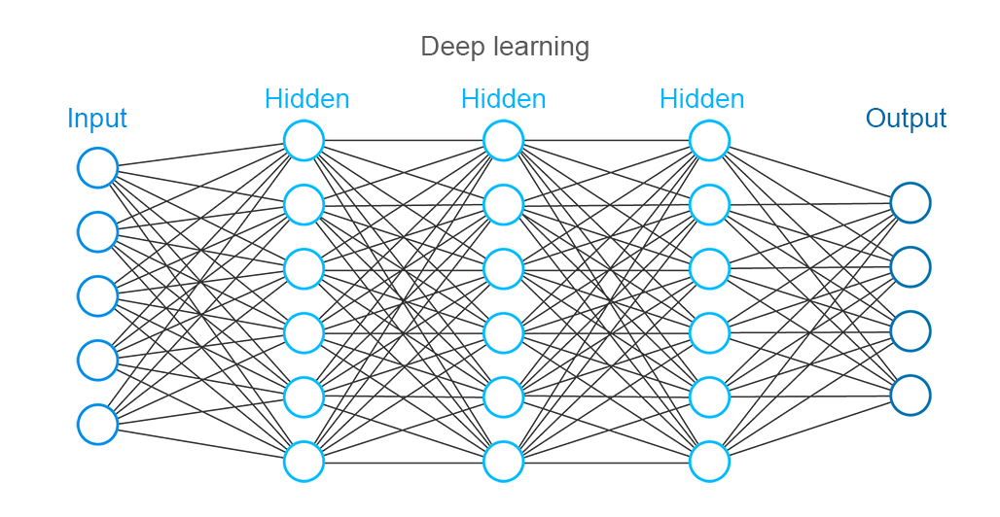
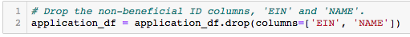
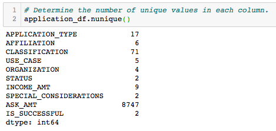
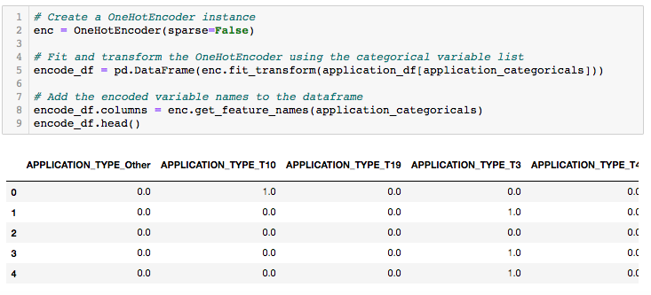

# Neural_Network_Charity_Analysis

## Overview of the Project

The purpose of this analysis was to employ neural networks and deep learning models in order to aid a fictitious company named AlphabetSoup, a philanthropic organization dedicated to providing funding to organizations whose goals it deemed worthwhile, in vetting donation applicants.  By training the deep learning models on a retrospective dataset of donations for both successful and unsuccessful outcomes, the model served as a binary classifier to predict whether applicants would be successful if given funding.  

The deep learning model performed supervised learning by training on the "feature" columns from the dataset to predict a "target" column containing binary values of "0" or "1", as these numbers were indicative of whether the donation of each observation produced an unsuccessful or successful outcome, respectively.  To optimize the performance and prepare it for the neural network model, the data required significant preprocessing.  Following this, the data was compliled, trained, and the results were evaluated.  The details and results of this process are described further below.

---------------------------------------------
## Resources:

Data Sources: 

    charity_data.csv

Software: 

    Jupyter Notebook 6.0.3, 
    tensorflow 2.4.1, 
    Visual Studio Code 1.49.2
    scikit-learn 0.23.2
    pandas 1.0.5
--------

## Results:

### Data Preprocessing

To begin, the data was inspected and a few initial observations were analyzed prior to building the neural network.  The process began by dropping two unnecessary columns, "EIN" and "NAME", which served as neither targets nor features since they were considered unuseful for predicting the success of a donation.

- The target variable for this model was the "IS_SUCCESSFUL" column
- the feature variables included the following:

    APPLICATION_TYPE—Alphabet Soup application type  
    AFFILIATION—Affiliated sector of industry  
    CLASSIFICATION—Government organization classification  
    USE_CASE—Use case for funding  
    ORGANIZATION—Organization type  
    STATUS—Active status  
    INCOME_AMT—Income classification  
    SPECIAL_CONSIDERATIONS—Special consideration for application  
    ASK_AMT—Funding amount requested

    Note, many of these feature columns were later converted to "dummy" variables using the "one hot encoder" method from scikit-learn in order to convert them to numerical format (discussed later).  Thus, the number of input features ultimately used by the neural network was far greater (43) than the nine features listed above.  Nevertheless, the input data values for the model was ultimately derived from these aforementioned columns.

- Next, the number of unique values from each column was calculated using the nunique() method from the pandas library.  This allowed us to visualize which columns had more than 10 unique values and, thus, would need bucketing into an "other" column to reduce the number of dummy columns that would result when converting categorical variables to numerical format.  Note, two categorical variables, "APPLICATION_TYPE" and "CLASSIFICATION" fell into this category.  "ASK_AMT" was a numerical column and thus did not need attention.

    

    

### Compiling, Training, and Evaluating the Model

To compile, train and evaluate the model, 

- Considering the length of the input was 125 features and the output contained one neuron, the number of neurons chosen for each hidden layer needed to fall somewhere in between.  Two-thirds of the number of input layers gives eighty-three neurons which is a good start.  Thus, eighty neurons in the first layer was used.  In the second hidden layer, 30 layers was chosen as it was enough to provide adquate 

---------------------------

## Summary
