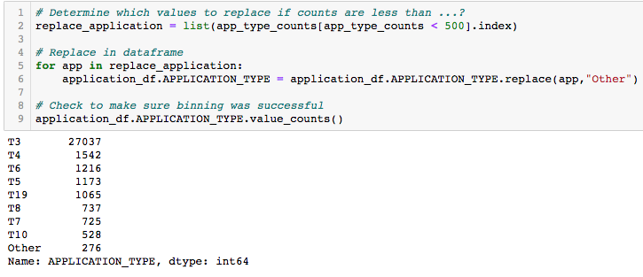
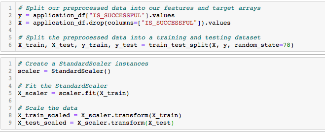
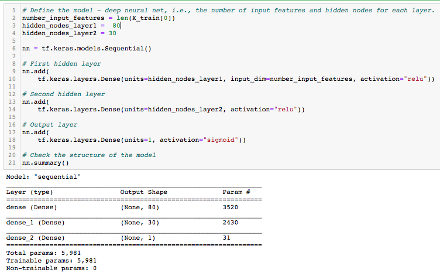
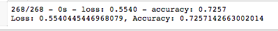
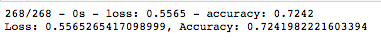
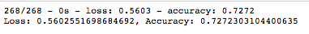

# Neural_Network_Charity_Analysis

## Overview of the Project

The purpose of this analysis was to employ deep learning models in order to aid a fictitious company named AlphabetSoup, a philanthropic organization dedicated to donating funds to organizations whose goals it deemed worthwhile, in vetting donation applicants.  By training a deep learning model on a retrospective dataset of about 30,000 historical donations for both successful and unsuccessful outcomes, the model served as a binary classifier to predict whether applicants would be successful if given funding.  In short, this would help AlphabetSoup know where to place their money.

The deep learning model performed supervised learning by training on the "feature" columns from the dataset to predict a "target" column containing binary values of "0" or "1", as these numbers were indicative of whether the donation of each observation produced an unsuccessful or successful outcome, respectively.  To optimize the performance and prepare it for the neural network model, the data required significant preprocessing.  Following this, the data was compliled, trained, and the results were evaluated.  The details and results of this process are described further below.

---------------------------------------------
## Resources:

Data Sources: 

    charity_data.csv

Software: 

    Jupyter Notebook 6.0.3, 
    tensorflow 2.4.1, 
    Visual Studio Code 1.49.2
    scikit-learn 0.23.2
    pandas 1.0.5
--------

## Results:

### Data Preprocessing

- To begin, the data was inspected and a few initial observations were analyzed prior to building the neural network.  The preprocessing began by dropping two unnecessary columns, "EIN" and "NAME", which served as neither targets nor features since they were considered unuseful for predicting the success of a donation.

    

- The target variable for this model was the "IS_SUCCESSFUL" column
- the feature variables included the following:

    APPLICATION_TYPE—Alphabet Soup application type  
    AFFILIATION—Affiliated sector of industry  
    CLASSIFICATION—Government organization classification  
    USE_CASE—Use case for funding  
    ORGANIZATION—Organization type  
    STATUS—Active status  
    INCOME_AMT—Income classification  
    SPECIAL_CONSIDERATIONS—Special consideration for application  
    ASK_AMT—Funding amount requested

     Note, many of these feature columns were later converted to "dummy" variables using the "one hot encoder" method from scikit-learn in order to convert them to numerical format (discussed later).  Thus, the number of input features ultimately used by the neural network was far greater (43) than the nine features listed above.  Nevertheless, the input data values for the model was ultimately derived from these aforementioned columns.

- Next, the number of unique values from each column was calculated using the nunique() method from the pandas library.  This allowed us to visualize which columns had more than 10 unique values and, thus, would need bucketing into an "other" column to reduce the number of dummy columns that would result when converting categorical variables to numerical format later.  Note, two categorical variables, "APPLICATION_TYPE" and "CLASSIFICATION" fell into this category.  "ASK_AMT" was a numerical column and thus did not need attention.

    

- To collapse all of the infrequent categorical values into a single "other" category for each of the two columns mentioned prior, the value counts were first determined.  For instance, the value counts for "APPLICATION_TYPE" were determined as follows:

    

- Next, a filtered list of these value counts was created to only include values from the column which occured infrequently.  In this case, we chose values which occured less than five-hundred times in the column.  Finally, a for loop combined with the replace method allowed us to replace all of those values with "other", thus reducing the number of unique values in the column (see image below).  The same procedure was used on the other relevant column ("CLASSIFICATION") as well. Again, this reduction in unique values made it less resource-intensive when employing one-hot-encoder later.

    

- Following this, a list was created containing only object/string types (categorical types) and the "one hot encoder" was used to create dummy variables.  This process was necessary as its use meant all of our features were now in numerical format, as required prior to the neural network implementation.

    

- Finally, the dataset was separated in the appropriate "y" target and "X" features as well as split into training and testing sets accordingly.  Furthermore, the data feature data was scaled which altered each variable to have a mean value of zero and a standard deviation of one.  This normalization process prevented variations in the magnitudinal scaling between columns from over-representing influence on predictions of the target during training.

    

### Compiling, Training, and Evaluating the Model

In the initial model created using the keras neural network library, the following parameters and techniques were employed to create and evaluate the neural network:

- The length of the input for the neural network was 43 features and the output was set to one neuron.  Twice the number of input layers is a good starting point for establishing the number of neurons for the first hidden layer.  Thus, the first attempt at a model design included 80 neurons for the first hidden layer.  In the second hidden layer, 30 layers was chosen as it was enough to adquate additional processing but not too much to result in overfitting to our model which would render the deep learning model unable to perform well on alternate datasets.  Both of these layers employed the "relu" activation function and the final output layer utilized the "sigmoid" function to classify the result as a 0 or 1 (unsuccessful vs successful prediction).

    

- From this first neural network model design, an evaluation was employed which resulted in a loss of about 55% and an accuracy score of about 72.6%.  This is arguably a decent outcome for a first attempt.

    

### Optimization Test

Although the initial neural network model produced moderate success, additional adjustments were made to the aforementioned procedures in attempt to see if such alterations would imporove performance of the model above 75% accuracy.  Note, with each successive change, the prior optimization test was kept rather than returned back to the original model settings.  The results are as follows:

- The first test was to see if dropping an extra feature might improve performance.  The feature chosen was from the column "SPECIAL_CONSIDERATION".  After re-running the notebook after the adjustment, the model produced practically no significant difference.

    

- The next optimization test involved adding more neurons to the first and second hidden layer.  Specifically, 20 extra neurons were added to each, resulting in 100 and 50 neurons to the first and second hidden layers, respectively.  This also produced nearly negligible difference from the original neural network model.

    

- As a third test, an additional hidden layer was included in the neural network model.  The new hidden layer used the same activation function as the first two layers and contained only 4 neurons.  The results were, once again, below 75%.

    

- As a final test in model design, the activation function was changed on all the first three layers (not including the output layer) from "relu" to "tanh".  Even after this additional test, the results showed neglible difference from the original neural network as shown:

    

---------------------------

## Summary

From the analysis, it is evident the deep neural network machine learning model produced a moderately useful binary classifier in predicting whether loaning to a given applicant will produce successful results.  However, the predictive capability never reached above 75% accuracy, even after additional optimization tests.  As such, it may be worthwhile to either attempt additional optimization techniques for this model or to try a new supervised learning classification model altogether for AlphabetSoup's needs.  For example, an ensemble-based random forest classifier may be a feasible option as a structurally similar comparison to a neural network.  In fact, if we run the random forest classifier from scikit-learn, all preprocessing being equal and, say, 128 estimators, we can obtain the following result:

As you can see, the alternate method fares similary to the deep learning model we examined in this analysis and additional hyperparameters could be tweaked to test the affects on its performance as well.  Overall, this analysis demonstrates not only a useful procedure for implementing a deep learning model but also the challenge of discerning the best instances for when to employ a deep learning model in the first place.  In the end, the best way to prepare and optimize deep learning models while keeping a broad understanding of all competitive supervised machine learning techniques is a skill that requires continual polish.